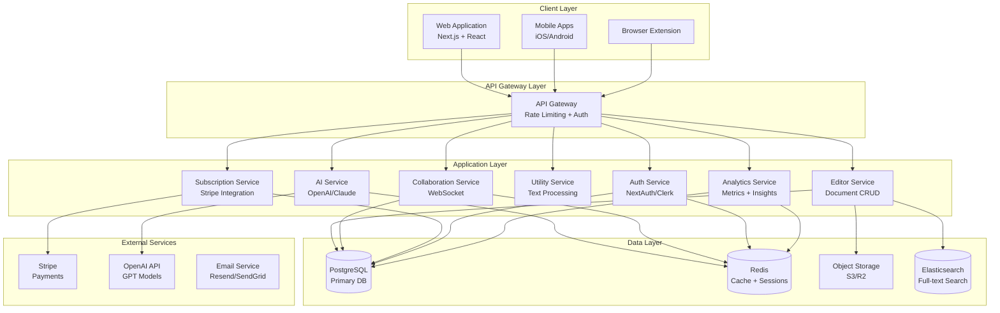

# Design Document: MianScribe Premium Transformation

## Overview

MianScribe will be transformed into a comprehensive, professional SaaS writing platform built on a modern, scalable architecture. The system will combine a rich text editor, extensive text utilities, AI-powered writing assistance, content analysis, developer tools, and collaborative features into a unified platform.

### Architecture Philosophy

The design follows a modular, service-oriented architecture with clear separation of concerns:

- **Frontend**: Next.js 14+ with React 18+ for a responsive, performant web application
- **Backend**: Node.js with TypeScript providing RESTful APIs and real-time services
- **Database**: PostgreSQL for relational data with Redis for caching and session management
- **AI Services**: Integration with OpenAI/Anthropic APIs for intelligent features
- **Storage**: Cloud object storage (S3/R2) for documents and media
- **Real-time**: WebSocket-based collaboration engine for live editing

The platform will be designed for horizontal scalability, high availability, and optimal performance across all user tiers.

## Architecture

### System Architecture Diagram



### Technology Stack

**Frontend:**
- Framework: Next.js 14+ (App Router)
- UI Library: React 18+
- Styling: Tailwind CSS + shadcn/ui
- Rich Text Editor: TipTap (ProseMirror-based)
- Code Editor: Monaco Editor
- State Management: Zustand
- Data Fetching: TanStack Query (React Query)
- Forms: React Hook Form + Zod
- Real-time: Socket.io Client
- Charts: Recharts
- Animations: Framer Motion

**Backend:**
- Runtime: Node.js 20+ with TypeScript
- Framework: Express.js or Fastify
- ORM: Prisma
- Authentication: NextAuth.js or Clerk
- Real-time: Socket.io
- Queue: BullMQ with Redis
- Validation: Zod
- Testing: Vitest + Supertest

**Database & Storage:**
- Primary Database: PostgreSQL 15+
- Cache: Redis 7+
- Object Storage: AWS S3 or Cloudflare R2
- Search: Elasticsearch or PostgreSQL Full-Text Search

**Infrastructure:**
- Hosting: Vercel (Frontend) + AWS/Railway (Backend)
- CDN: Cloudflare
- Monitoring: Sentry + LogRocket
- Analytics: PostHog or Mixpanel

## Components and Interfaces

### 1. Editor Component

The core editing experience built on TipTap with custom extensions.

**Key Features:**
- Rich text formatting (bold, italic, underline, headings, lists)
- Markdown support with live preview
- Auto-save with debouncing (30-second intervals)
- Undo/redo with history management
- Keyboard shortcuts
- Distraction-free mode
- Split view for document comparison

**Interface:**
```typescript
interface EditorProps {
  documentId: string;
  initialContent: JSONContent;
  onSave: (content: JSONContent) => Promise<void>;
  onUpdate: (content: JSONContent) => void;
  readOnly?: boolean;
  collaborators?: Collaborator[];
}

interface EditorCommands {
  setContent(content: JSONContent): void;
  getContent(): JSONContent;
  focus(): void;
  blur(): void;
  undo(): void;
  redo(): void;
  insertText(text: string): void;
  formatSelection(format: TextFormat): void;
}
```

### 2. Text Utilities Service

A collection of pure functions for text transformation and extraction.

**Modules:**
- Case Converter: camelCase, snake_case, PascalCase, kebab-case, UPPERCASE, lowercase, Title Case
- Extractor: emails, URLs, hashtags, emojis
- Formatter: JSON, XML, SQL, code (multi-language)
- Transformer: reverse, sort, deduplicate, slug generation
- Encoder: Base64, URL encoding, Unicode conversion
- Generator: Lorem Ipsum, passwords

**Interface:**
```typescript
interface TextUtility {
  name: string;
  category: UtilityCategory;
  execute: (input: string, options?: UtilityOptions) => UtilityResult;
}

interface UtilityResult {
  output: string;
  metadata?: Record<string, any>;
  error?: string;
}

type UtilityCategory = 
  | 'case-conversion'
  | 'extraction'
  | 'formatting'
  | 'transformation'
  | 'encoding'
  | 'generation';
```

### 3. AI Service

Wrapper around AI APIs (OpenAI, Anthropic) with rate limiting, caching, and error handling.

**Features:**
- Grammar and spell checking
- Paraphrasing and summarization
- Tone analysis and adjustment
- Content generation and expansion
- Translation (50+ languages)
- Headline and meta description generation
- Email and social media content generation

**Interface:**
```typescript
interface AIService {
  checkGrammar(text: string): Promise<GrammarIssue[]>;
  paraphrase(text: string, style?: WritingStyle): Promise<string>;
  summarize(text: string, length?: SummaryLength): Promise<string>;
  analyzeTone(text: string): Promise<ToneAnalysis>;
  adjustTone(text: string, targetTone: Tone): Promise<string>;
  translate(text: string, targetLang: Language): Promise<string>;
  generateContent(prompt: string, options: GenerationOptions): Promise<string>;
  generateHeadlines(topic: string, count: number): Promise<string[]>;
}

interface GrammarIssue {
  type: 'grammar' | 'spelling' | 'style' | 'punctuation';
  message: string;
  suggestions: string[];
  position: { start: number; end: number };
  severity: 'error' | 'warning' | 'info';
}

interface ToneAnalysis {
  primary: Tone;
  confidence: number;
  scores: Record<Tone, number>;
}

type Tone = 'formal' | 'casual' | 'professional' | 'friendly' | 'authoritative';
```

### 4. Analytics Engine

Comprehensive text analysis and metrics calculation.

**Features:**
- Word and character counting
- Reading time and speaking time estimation
- Readability scores (Flesch-Kincaid, Gunning Fog, SMOG, Coleman-Liau)
- Keyword density analysis
- SEO scoring
- Sentiment analysis
- Vocabulary richness metrics
- Sentence and paragraph analysis

**Interface:**
```typescript
interface AnalyticsEngine {
  calculateBasicStats(text: string): BasicStats;
  calculateReadability(text: string): ReadabilityScores;
  analyzeKeywords(text: string): KeywordAnalysis;
  calculateSEOScore(text: string, targetKeywords: string[]): SEOScore;
  analyzeSentiment(text: string): SentimentAnalysis;
  analyzeVocabulary(text: string): VocabularyMetrics;
  analyzeSentences(text: string): SentenceAnalysis;
}

interface BasicStats {
  characters: number;
  charactersNoSpaces: number;
  words: number;
  sentences: number;
  paragraphs: number;
  readingTime: number; // minutes
  speakingTime: number; // minutes
}

interface ReadabilityScores {
  fleschKincaid: number;
  gunningFog: number;
  smogIndex: number;
  colemanLiau: number;
  readingLevel: string;
}

interface KeywordAnalysis {
  keywords: Array<{ word: string; count: number; density: number }>;
  phrases: Array<{ phrase: string; count: number }>;
}
```

### 5. Document Management Service

Handles document CRUD operations, versioning, and organization.

**Features:**
- Create, read, update, delete documents
- Folder organization with nesting
- Tagging system
- Version history with diff tracking
- Search and filtering
- Bulk operations

**Interface:**
```typescript
interface DocumentService {
  createDocument(data: CreateDocumentInput): Promise<Document>;
  getDocument(id: string): Promise<Document>;
  updateDocument(id: string, data: UpdateDocumentInput): Promise<Document>;
  deleteDocument(id: string): Promise<void>;
  listDocuments(filters: DocumentFilters): Promise<PaginatedDocuments>;
  searchDocuments(query: string, filters?: SearchFilters): Promise<Document[]>;
  getVersionHistory(documentId: string): Promise<DocumentVersion[]>;
  restoreVersion(documentId: string, versionId: string): Promise<Document>;
}

interface Document {
  id: string;
  userId: string;
  title: string;
  content: JSONContent;
  folderId?: string;
  tags: string[];
  isPublic: boolean;
  createdAt: Date;
  updatedAt: Date;
  metadata: DocumentMetadata;
}

interface DocumentMetadata {
  wordCount: number;
  characterCount: number;
  readingTime: number;
  lastEditedBy?: string;
}
```

### 6. Collaboration Engine

Real-time collaborative editing using operational transformation or CRDT.

**Features:**
- Real-time synchronization
- User presence (cursors, selections)
- Conflict resolution
- Comment threads
- Permission management

**Interface:**
```typescript
interface CollaborationEngine {
  joinSession(documentId: string, userId: string): Promise<Session>;
  leaveSession(sessionId: string): void;
  broadcastChange(sessionId: string, change: DocumentChange): void;
  addComment(documentId: string, comment: Comment): Promise<Comment>;
  resolveComment(commentId: string): Promise<void>;
  updatePermissions(documentId: string, userId: string, permission: Permission): Promise<void>;
}

interface Session {
  id: string;
  documentId: string;
  participants: Participant[];
  startedAt: Date;
}

interface Participant {
  userId: string;
  name: string;
  avatar: string;
  cursor?: CursorPosition;
  selection?: SelectionRange;
  color: string;
}

type Permission = 'view' | 'comment' | 'edit' | 'admin';
```

### 7. Subscription Manager

Handles user subscriptions, billing, and feature access control.

**Features:**
- Tier management (Free, Pro, Team, Enterprise)
- Stripe integration for payments
- Usage tracking and quota enforcement
- Upgrade/downgrade flows
- Billing history

**Interface:**
```typescript
interface SubscriptionManager {
  getSubscription(userId: string): Promise<Subscription>;
  createSubscription(userId: string, plan: Plan): Promise<Subscription>;
  updateSubscription(userId: string, plan: Plan): Promise<Subscription>;
  cancelSubscription(userId: string): Promise<void>;
  checkFeatureAccess(userId: string, feature: Feature): Promise<boolean>;
  trackUsage(userId: string, resource: Resource, amount: number): Promise<void>;
  getUsageStats(userId: string): Promise<UsageStats>;
}

interface Subscription {
  id: string;
  userId: string;
  plan: Plan;
  status: SubscriptionStatus;
  currentPeriodStart: Date;
  currentPeriodEnd: Date;
  stripeSubscriptionId?: string;
}

type Plan = 'free' | 'pro' | 'team' | 'enterprise';
type SubscriptionStatus = 'active' | 'canceled' | 'past_due' | 'trialing';

interface UsageStats {
  aiRequests: { used: number; limit: number };
  storage: { used: number; limit: number };
  documents: { count: number; limit: number };
}
```

### 8. Export Service

Converts documents to various formats.

**Features:**
- PDF generation with styling
- DOCX export with formatting preservation
- Markdown, HTML, RTF, TXT export
- Batch export for workspaces
- Custom templates

**Interface:**
```typescript
interface ExportService {
  exportDocument(documentId: string, format: ExportFormat): Promise<Buffer>;
  exportWorkspace(userId: string): Promise<Buffer>; // ZIP archive
  exportWithTemplate(documentId: string, templateId: string): Promise<Buffer>;
}

type ExportFormat = 'pdf' | 'docx' | 'txt' | 'md' | 'html' | 'rtf';
```

## Data Models

### Database Schema

**Users Table:**
```typescript
interface User {
  id: string; // UUID
  email: string; // unique
  name: string;
  avatar?: string;
  passwordHash?: string; // nullable for OAuth users
  emailVerified: boolean;
  plan: Plan;
  stripeCustomerId?: string;
  preferences: UserPreferences;
  createdAt: Date;
  updatedAt: Date;
}

interface UserPreferences {
  theme: 'light' | 'dark' | 'auto';
  language: string;
  editorFontSize: number;
  notifications: NotificationPreferences;
}
```

**Documents Table:**
```typescript
interface Document {
  id: string; // UUID
  userId: string; // FK to users
  title: string;
  content: JSONContent; // TipTap JSON format
  folderId?: string; // FK to folders
  tags: string[];
  isPublic: boolean;
  shareToken?: string; // for public sharing
  createdAt: Date;
  updatedAt: Date;
  deletedAt?: Date; // soft delete
}
```

**Folders Table:**
```typescript
interface Folder {
  id: string; // UUID
  userId: string; // FK to users
  name: string;
  parentId?: string; // FK to folders (self-reference)
  color?: string;
  createdAt: Date;
  updatedAt: Date;
}
```

**DocumentVersions Table:**
```typescript
interface DocumentVersion {
  id: string; // UUID
  documentId: string; // FK to documents
  content: JSONContent;
  changeDescription?: string;
  createdBy: string; // FK to users
  createdAt: Date;
}
```

**Templates Table:**
```typescript
interface Template {
  id: string; // UUID
  userId?: string; // FK to users (null for system templates)
  title: string;
  description: string;
  content: JSONContent;
  category: string;
  isPublic: boolean;
  isPremium: boolean;
  downloads: number;
  rating: number;
  previewImage?: string;
  createdAt: Date;
  updatedAt: Date;
}
```

**Collaborators Table:**
```typescript
interface Collaborator {
  id: string; // UUID
  documentId: string; // FK to documents
  userId: string; // FK to users
  permission: Permission;
  invitedBy: string; // FK to users
  invitedAt: Date;
  acceptedAt?: Date;
}
```

**Comments Table:**
```typescript
interface Comment {
  id: string; // UUID
  documentId: string; // FK to documents
  userId: string; // FK to users
  content: string;
  position?: number; // character position in document
  parentId?: string; // FK to comments (for replies)
  resolved: boolean;
  createdAt: Date;
  updatedAt: Date;
}
```

**Subscriptions Table:**
```typescript
interface Subscription {
  id: string; // UUID
  userId: string; // FK to users
  plan: Plan;
  status: SubscriptionStatus;
  stripeSubscriptionId?: string;
  currentPeriodStart: Date;
  currentPeriodEnd: Date;
  cancelAtPeriodEnd: boolean;
  createdAt: Date;
  updatedAt: Date;
}
```

**AIUsage Table:**
```typescript
interface AIUsage {
  id: string; // UUID
  userId: string; // FK to users
  feature: string; // e.g., 'grammar', 'paraphrase', 'summarize'
  tokensUsed: number;
  cost: number; // in cents
  timestamp: Date;
}
```

**Analytics Table:**
```typescript
interface AnalyticsEvent {
  id: string; // UUID
  userId?: string; // FK to users (nullable for anonymous)
  eventType: string;
  eventData: Record<string, any>;
  sessionId: string;
  timestamp: Date;
}
```

**Teams Table:**
```typescript
interface Team {
  id: string; // UUID
  name: string;
  ownerId: string; // FK to users
  plan: Plan;
  stripeCustomerId?: string;
  settings: TeamSettings;
  createdAt: Date;
  updatedAt: Date;
}

interface TeamSettings {
  allowPublicSharing: boolean;
  requireTwoFactor: boolean;
  sessionTimeout: number; // minutes
}
```

**TeamMembers Table:**
```typescript
interface TeamMember {
  id: string; // UUID
  teamId: string; // FK to teams
  userId: string; // FK to users
  role: TeamRole;
  invitedBy: string; // FK to users
  joinedAt: Date;
}

type TeamRole = 'owner' | 'admin' | 'member' | 'guest';
```

### Redis Data Structures

**Session Storage:**
```typescript
// Key: session:{sessionId}
interface SessionData {
  userId: string;
  expiresAt: number;
  deviceInfo: string;
}
```

**Document Locks (for collaboration):**
```typescript
// Key: lock:document:{documentId}
interface DocumentLock {
  userId: string;
  acquiredAt: number;
  expiresAt: number;
}
```

**Rate Limiting:**
```typescript
// Key: ratelimit:{userId}:{feature}
interface RateLimitData {
  count: number;
  resetAt: number;
}
```

**AI Response Cache:**
```typescript
// Key: ai:cache:{hash(prompt)}
interface CachedAIResponse {
  response: string;
  createdAt: number;
  expiresAt: number;
}
```

### API Request/Response Models

**Authentication:**
```typescript
interface LoginRequest {
  email: string;
  password: string;
}

interface LoginResponse {
  user: User;
  accessToken: string;
  refreshToken: string;
}

interface RegisterRequest {
  email: string;
  password: string;
  name: string;
}
```

**Document Operations:**
```typescript
interface CreateDocumentRequest {
  title: string;
  content?: JSONContent;
  folderId?: string;
  tags?: string[];
}

interface UpdateDocumentRequest {
  title?: string;
  content?: JSONContent;
  tags?: string[];
}

interface DocumentResponse {
  document: Document;
  collaborators?: Collaborator[];
  permissions: Permission;
}
```

**AI Operations:**
```typescript
interface GrammarCheckRequest {
  text: string;
  language?: string;
}

interface GrammarCheckResponse {
  issues: GrammarIssue[];
  correctedText: string;
}

interface ParaphraseRequest {
  text: string;
  style?: WritingStyle;
  creativity?: number; // 0-1
}

interface ParaphraseResponse {
  original: string;
  paraphrased: string;
  alternatives?: string[];
}
```

**Text Utility Operations:**
```typescript
interface UtilityRequest {
  utilityName: string;
  input: string;
  options?: Record<string, any>;
}

interface UtilityResponse {
  output: string;
  metadata?: Record<string, any>;
  executionTime: number; // milliseconds
}
```
